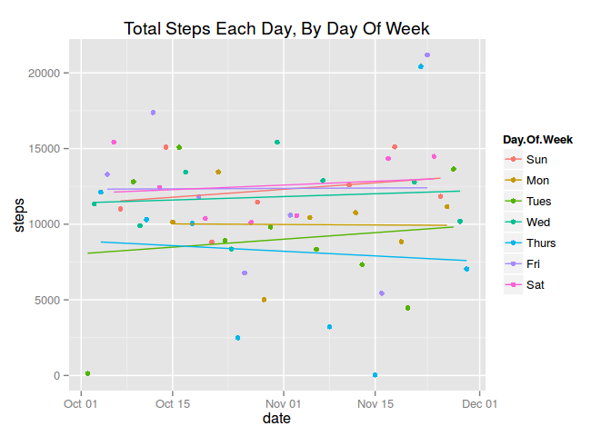

# Reproducible Research: Peer Assessment 1
Derek Slone-Zhen  
14th October 2014  


## Loading and preprocessing the data

The Activity monitoring data for this assignement is available directly at https://d396qusza40orc.cloudfront.net/repdata%2Fdata%2Factivity.zip and is also available within [this git repositorty](https://github.com/dereksz/RepData_PeerAssessment1).

The variables included in this dataset are:

* **steps**: Number of steps taking in a 5-minute interval (missing
    values are coded as `NA`)

* **date**: The date on which the measurement was taken in YYYY-MM-DD
    format

* **interval**: Identifier for the 5-minute interval in which
    measurement was taken

First, we load the libraries that we are dependant on.  If this fails, please install these packages 
from [CRAN](http://cran.r-project.org/).


```r
library(lubridate)  # for days of the week as orderred factors
library(ggplot2)    # the best plotting library? ;-)
library(plyr)       # helps us do the imputing easily!
```

Then we must load the data, unzipping it first from the zip file.

We also add an "hour" column that holds a decimal version of the interval.  The `interval` is 
encoded as HHMM packed into an integer.  This results in a "gap" in the `interval` sequence between
[HH]55 and [HH+1]00, which disturbes the graphing when using `interval` as a "continueous" variable
(as opposed to discrete).

We also add `Day.Of.Week` and `weekend` fields using 
[lubridate](http://cran.r-project.org/web/packages/lubridate/index.html).
(This is more useful than the [weekday](http://www.inside-r.org/r-doc/base/months) in base `R`, as
is produces ordered factors for the weekdays rather then plain characters; this then determines
ordering in graph ledgends and the like in a way that is sympathetic with human expectation.)

Finaly, we create a subsetted version of the data frame with missing values removed.


```r
df <- read.csv(unz("activity.zip","activity.csv"), colClasses=c('integer','Date','integer'))
# Add a 'continuous' interval using decimal hours for better presentation on some graphs
interval_to_hour <- function(i) i %/% 100 + (i %% 100) / 60 
df$hour <- interval_to_hour(df$interval)
df$Day.Of.Week = wday(df$date, label = TRUE, abbr = TRUE)
# The 'labels' are the correct way around, because factor will order TRUE and FALSE alphabetically
as.weekday.end <- function(date) factor(wday(date) %in% c(1,7),labels=c('Weekday','Weekend'))
df$weekend <- as.weekday.end(df$date)
# Now compute data set with NAs removed
df.na.rm <- df[!is.na(df$steps),]
```

## What is mean total number of steps taken per day?

First, we calculate our daily summaries from our data frame with missing values removed:


```r
df.daily <- aggregate(steps ~ date, data = df.na.rm, FUN=sum) # Summarised down to daily level
df.daily$Day.Of.Week <-wday(df.daily$date, label = TRUE, abbr = TRUE)
```

The mean and median number of steps taken per day can be calculated as:
 

```r
mean(df.daily$steps)
```

```
## [1] 10766
```

```r
median(df.daily$steps)
```

```
## [1] 10765
```

Plotting this, we can see a roughly normal distribution of the daily number of steps in the following histogram,
with the mean added in red, and the median added in blue
(although they are so close together it is actually hard to distinguish the two - 
you will probably percieve this as a single purple line):


```r
g <- df.daily$steps
h <- hist(g, xlab='Steps', main="Histogram of Steps per Day",breaks=10)
abline(v=mean(g),col='red')
abline(v=median(g),col='blue')
# The normal fit is thank to http://stackoverflow.com/questions/20078107/overlay-normal-curve-to-histogram-in-r
xfit <- seq(min(g),max(g),length=100)
yfit <- dnorm(xfit,mean=mean(g),sd=sd(g)) 
multiplier <- h$counts / h$density
lines(xfit, yfit*multiplier[1], col="red", lwd=2)
```

 

## (Additional) What is the overall trend over time?

An analisys of any trending within the data is essential so that our choise of imupting mechanism 
can be done in a fashion that is ecologically valid.

The overall trend over time is:


```r
qplot(x=date, y=steps, data=df.daily,
      geom='point',
      main="Total Steps Each Day") +
  geom_smooth(method='lm')
```

 

No real trend here.

The overall trend over time, coloured by day of week:


```r
qplot(x=date, y=steps, data=df.daily,
      colour=Day.Of.Week, 
      geom='point',
      main="Total Steps Each Day, By Day Of Week") +
  geom_smooth(method='lm',se=FALSE)
```

 

(The error bands on the last plot were so large that they have been dropper for better readability.)

## What is the average daily activity pattern?

We examine the mean number of steps for each interval across our entire data set, and calculate the mode of that
data set:


```r
df.intra.day.average <- aggregate(steps ~ hour + interval, data = df.na.rm, FUN=mean) # Summarised by steps by interval/hour
modal.pos <- which.max(df.intra.day.average$steps) # Find which row number holds the maximum value
modal.hour <- df.intra.day.average$hour[modal.pos] # Extract the hour representation
modal.interval <- df.intra.day.average$interval[modal.pos] # Extract interval representation

qplot(data=df.na.rm, x=hour, y=steps
      , geom='line'
      , stat='summary', fun.y='mean'
      , main="Average Steps per Time Interval", xlab='Interval', ylab='Average Steps'
      ) +
  scale_x_continuous(breaks=0:24) +
  geom_vline(xintercept=modal.hour,colour='red',linetype = "dotted")
```

 

The mode of the intra-day averages, indicating the 5-minute window with the maximum average number of steps, 
is 835, that is 08:35 inclusive to 08:40 exclusive - that's probably everyone is walking to work!

## Are there differences in activity patterns between weekdays and weekends?

(I will return to imputing _after_ looking at the weekday / weekend differences, please bear with me!)

We use `qplot`'s built in `stat` and `fun.y` to directly display the graph that shows the mean number of steps 
per interval, and its built-in faceting to distinguish weekdays from weekends:


```r
qplot(data=df.na.rm, x=hour, y=steps, facets=weekend ~ ., geom='line', stat='summary', fun.y='mean',
      main='Average number of steps per interval:\n Weekday versus Weekend') +
  scale_x_continuous(breaks=seq(0,24,by=3)) +
  geom_smooth()
```

 

Clearly there is quite a difference between these two.  The weekday has a sigificant spike at around the 8:30am mark,
and is essentially bi- or tri-modal distribution with peaks around getting to work, leaving work, and a minor peek
around lunchtime.
The weekend smoothed curve shows a decidedly different profile.

## Imputing missing values

While the brief suggests we do this as we like, I would like an approach that is more justifiable.  
We have already shown that the overall number of steps per day across the whole period of the 
study is reasonabley constant.  We now consider the whereabouts of the missing values, and other
characteristicts of the data that might impact how we choose our imputed values.

### Establishing the shape of the missing values

First, let us create a data set denoting _just_ the missing values.


```r
df.missing <- df[is.na(df$steps),-1]
num.missing <- nrow(df.missing)
num.missing
```

```
## [1] 2304
```

This shows us that there are 2304 missing data points.
Next, see how many we have in total by date and by hour, to see if there is a pattern in these missing values.


```r
qplot(x=date, y=hour, data=df.missing, stat='identity', alpha=I(0.3), main="Scatter of missing values by date & interval") +
  scale_y_continuous(breaks=seq(0,24,by=3))
```

 

The plot suggests strongly that we have many missing values on a few specific days.
So we further summarise the missing into their day-groups to check the extent of this hypothesis.
(And add in the weekdays to see if that may also be a contributing factor.)


```r
df.missing.by.day <- aggregate(interval ~ date, data = df.missing, FUN='length')
df.missing.by.day$weekday <- wday(df.missing.by.day$date, label = TRUE, abbr = TRUE)
df.missing.by.day
```

```
##         date interval weekday
## 1 2012-10-01      288     Mon
## 2 2012-10-08      288     Mon
## 3 2012-11-01      288   Thurs
## 4 2012-11-04      288     Sun
## 5 2012-11-09      288     Fri
## 6 2012-11-10      288     Sat
## 7 2012-11-14      288     Wed
## 8 2012-11-30      288     Fri
```

We discover that the NAs actually apply to the whole of the day in which NAs occur
(there are 288 5-minute slices in 24-hours).  
That is, for a given day, we either have complete data or no data.

### Mechanisms for Imputing

The first obvious method of imputing would be to simply take the average for the interval across all days and use that
to impute the missing values identified above.  However, we have already seen a different pattern between 
week days and weekends.  We have already shown that there is little systemic up-ward or down-ward trend in the data.

The follwoing plot tries to show the realtionship between date, interval, and number of steps, by using the size of the 
'dot' to denote the numer of steps for a given date cross interval, and using colour to distinguish the day of the 
week.  (We first restrict the plot to observations with a non-zero step value simply to remove the uninformative
noise around the x-axis.)


```r
qplot(data=df.na.rm[df.na.rm$steps>0,], x=date, y=hour, size=steps, colour=Day.Of.Week, alpha=I(0.5))
```

 

Trying to cast that into a more traditional graphic from which we can read off numerical differences,
we can display a box and whisker plot of the number os steps each day, by day of week:


```r
qplot(data=df.daily, x=Day.Of.Week, y=steps, geom='boxplot', main="Steps per day by Day of Week") 
```

 

The above plots do seem to indicate a difference in distribution on each day.  Therefore we choose 
to impute missing values using the average for the interval and day of week.


```r
# From a pattern at http://www.mail-archive.com/r-help@r-project.org/msg58289.html
impute.mean <- function(x) replace(x, is.na(x), mean(x, na.rm = TRUE))
df2 <- ddply(df, .(Day.Of.Week, interval), transform, steps = impute.mean(steps))
```

### Effects of Imputing

Repeating our earlier steps to generate a step histogram:


```r
df2.daily <- aggregate(steps ~ date, data = df2, FUN=sum) # Summarised down to daily level
df2.daily$Day.Of.Week <-wday(df2.daily$date, label = TRUE, abbr = TRUE)
mean(df2.daily$steps)
```

```
## [1] 10821
```

```r
median(df2.daily$steps)
```

```
## [1] 11015
```

```r
g <- df2.daily$steps
h <- hist(g, xlab='Steps', main="Histogram of Steps per Day",breaks=10)
abline(v=mean(g),col='red')
abline(v=median(g),col='blue')
# The normal fit is thank to http://stackoverflow.com/questions/20078107/overlay-normal-curve-to-histogram-in-r
xfit <- seq(min(g),max(g),length=100)
yfit <- dnorm(xfit,mean=mean(g),sd=sd(g)) 
multiplier <- h$counts / h$density
lines(xfit, yfit*multiplier[1], col="red", lwd=2)
```

 

This shows the mean to have a slight uplift, (now 10,821 
versus an original 10,766, 
a 0.51% uplift), 
but shows an uplift in the median (now being 11,015 
rather than 10,765, a 
2.3% uplift).

